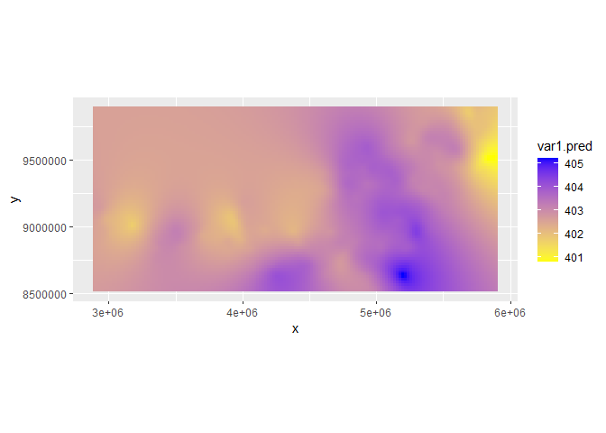

<!-- README.md is generated from README.Rmd. Please edit that file -->

# canteral-cap-3

## Carregando o pacote

``` r
library(tidyverse)
library(gstat)
library(sp)
source("R/my-functions.R")
```

## Lendo a base de dados

``` r
arco_desmatamento <- readr::read_rds("data/arco_desmatamento.rds")
```

## Conhecendo a base

``` r
head(arco_desmatamento)
#> # A tibble: 6 × 16
#>   latitude longitude      x      y data                  mes   ano estacao  xco2
#>      <dbl>     <dbl>  <dbl>  <dbl> <dttm>              <dbl> <dbl> <chr>   <dbl>
#> 1   -0.903     -47.1 5.77e6 9.90e6 2015-01-01 00:00:00     1  2015 Chuvosa    NA
#> 2   -0.903     -47.4 5.74e6 9.90e6 2015-01-01 00:00:00     1  2015 Chuvosa    NA
#> 3   -0.903     -47.6 5.71e6 9.90e6 2015-01-01 00:00:00     1  2015 Chuvosa    NA
#> 4   -1.15      -46.9 5.80e6 9.87e6 2015-01-01 00:00:00     1  2015 Chuvosa    NA
#> 5   -1.15      -47.1 5.77e6 9.87e6 2015-01-01 00:00:00     1  2015 Chuvosa    NA
#> 6   -1.15      -47.4 5.74e6 9.87e6 2015-01-01 00:00:00     1  2015 Chuvosa    NA
#> # ℹ 7 more variables: sif <dbl>, ndvi <dbl>, lai <dbl>, lst_dia <dbl>,
#> #   lst_noite <dbl>, lst_amp <dbl>, ec <dbl>
```

# Análise geoestatística

## grid refinado para a interpolação

``` r
df_grid <- arco_desmatamento %>% 
  group_by(x,y) %>% 
  summarise(z = mean(xco2,na.rm = TRUE))

x<-df_grid$x
y<-df_grid$y
dis <- 20000 #Distância entre pontos
grid <- expand.grid(x=seq(min(x),max(x),dis), y=seq(min(y),max(y),dis))
sp::gridded(grid) = ~ x + y
```

## filtrar o banco de dados

``` r
my_string <- "xco2"
my_year <- 2020
df <- my_df_generator(arco_desmatamento, my_year, my_string)
head(df)
#> # A tibble: 6 × 3
#> # Groups:   x [6]
#>         x       y     z
#>     <dbl>   <dbl> <dbl>
#> 1 2922219 9140533  403.
#> 2 2923441 9111555  403.
#> 3 2931621 8937758  403.
#> 4 2949768 9141688  406.
#> 5 2950973 9112748  404.
#> 6 2952218 9083811  403.
```

## passando para o objeto

``` r
sp::coordinates(df)=~ x+y  
form <- z ~ 1 
```

## Verificando o Variograma experimental

``` r
cutoff_p <- 5e5
width_p <- 20
vari <- variogram(form, 
                  width = cutoff_p/width_p,
                  cutoff = cutoff_p ,
                  data=df)
vari %>%  
  ggplot(aes(x=dist, y=gamma)) +
  geom_point()
```

<!-- -->

``` r
m_vari <- fit.variogram(vari,
                        vgm(2.5,"Sph",16.5e5,3))
plot(vari,model=m_vari, col=1,pl=F,pch=16)
```

<!-- -->

``` r


# jpeg(paste0("semivariogramas/",my_string,"-",my_year,".jpeg"),         # File name
#        width=8, height = 8, units=c("cm"), res = 300)
#     plot(vari, model=m_vari, col=1,pl=F,pch=16,
#          cex.axis=0.5,cex.lab = 0.5, cex=0.75,
#          main = "f) 2020 -"~Xco[2]~(ppm),
#          xlab="Distância de separação (m)", ylab="Semivariância")
#     
# 
# dev.off() 
```

## Krigagem

``` r
ko_var <- krige(formula=form, df, grid, model=m_vari, 
    block=c(0,0),
    nsim=0,
    na.action=na.pass,
    debug.level=-1,  
    )
#> [using ordinary kriging]
#>   3% done 17% done 31% done 46% done 60% done 74% done 88% done100% done
```

``` r
as.tibble(ko_var)  %>%  
  ggplot(aes(x=x, y=y)) + 
  geom_tile(aes(fill = var1.pred)) +
  scale_fill_gradient(low = "yellow", high = "blue") + 
  coord_equal()
```

<!-- -->

``` r
contorno_arco <- read_rds("data/contorno_arco.rds")
pol_arco <- contorno_arco %>% as.matrix()
plot(as.tibble(grid) )
points(pol_arco[,1],pol_arco[,2],col="red")
```

<!-- -->

``` r
ko_var_df <- as.tibble(ko_var) %>% 
  mutate(flag = def_pol(x,y,pol_arco))
# como gravar ko_var_df de forma que tenhamos x, y e o nome da variável que está em "my_string)

obj_exp <- ko_var_df[1:3]
names(obj_exp) <- c("x","y",my_string)

# writexl::write_xlsx(obj_exp, paste0("mapas/",my_string,
#                                "-",my_year,".xlsx"))
```

``` r
# jpeg(paste0("mapas/",my_string,"-",my_year,".jpeg"),         # File name
#        width=25, height = 15, units=c("cm"), res = 300)
# 
# ko_var_df %>% 
#   filter(flag) %>% 
#     ggplot(aes(x=x,y=y)) +
#     geom_tile(aes(fill = var1.pred)) +
#     scale_fill_gradient(low = "#FFD92F", high = "#238B45") +
#     coord_equal() +labs(x="",y="") +
#   theme(
#     plot.title = element_text(size = 20),
#     axis.text.x = element_text(size = 15),
#     axis.text.y = element_text(size = 15),
#     legend.text = element_text(size = 12),
#     legend.title = element_text(size = 15)) +
#   labs(fill="LAI", title = paste0("f) ", my_year)) + 
#   map_theme()
# 
# #scale_fill_gradient(low = "#984EA3", high = "#FFD92F") - SIF
# #scale_fill_gradient(low = "yellow", high = "#543005")  - LST_Amp
# #scale_fill_gradient(low = "#FFD92F", high = "#238B45") - LAI
# dev.off()
```

## Manipulação do banco de dados

### Listando aquivos xlsx

``` r
files <- list.files("mapas/", 
                    pattern = "xlsx",
                    full.names = TRUE)
```

``` r
my_xlsx_reader <- function(my_way){
  df <- readxl::read_xlsx(my_way)
  my_string <- str_split(my_way,pattern = "[/.-]",simplify = TRUE)
  
  df <- df %>% 
    mutate(variable = my_string[1,2],
           year = my_string[1,3])
  names(df) <- c("x","y","z","variable","year")
  df
}
df_final <- purrr::map_df(files,my_xlsx_reader)
df_final$variable %>% unique()
#> [1] "lai"     "lst_amp" "ndvi"    "sif"     "xco2"
df_final$year %>% unique()
#> [1] "2015" "2016" "2017" "2018" "2019" "2020"

df_final %>% 
  pivot_wider(names_from = variable, values_from = z)
#> # A tibble: 62,514 × 8
#>          x       y year    lai lst_amp  ndvi   sif  xco2
#>      <dbl>   <dbl> <chr> <dbl>   <dbl> <dbl> <dbl> <dbl>
#>  1 2895911 8521695 2015   3.52    7.43 0.626 0.785  402.
#>  2 2915911 8521695 2015   3.52    7.47 0.628 0.785  402.
#>  3 2935911 8521695 2015   3.52    7.52 0.629 0.785  402.
#>  4 2955911 8521695 2015   3.52    7.57 0.631 0.785  402.
#>  5 2975911 8521695 2015   3.52    7.62 0.633 0.785  402.
#>  6 2995911 8521695 2015   3.52    7.66 0.636 0.785  402.
#>  7 3015911 8521695 2015   3.52    7.71 0.639 0.785  402.
#>  8 3035911 8521695 2015   3.52    7.75 0.642 0.785  402.
#>  9 3055911 8521695 2015   3.52    7.78 0.646 0.785  402.
#> 10 3075911 8521695 2015   3.52    7.80 0.649 0.785  402.
#> # ℹ 62,504 more rows
```
