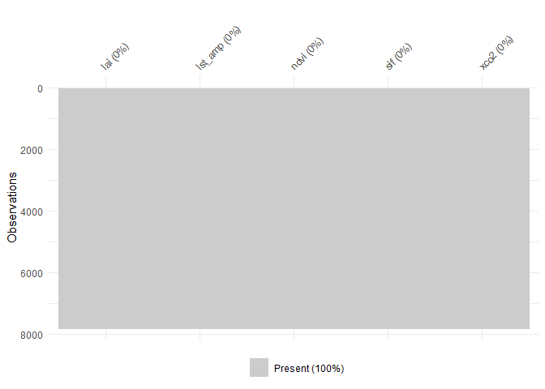
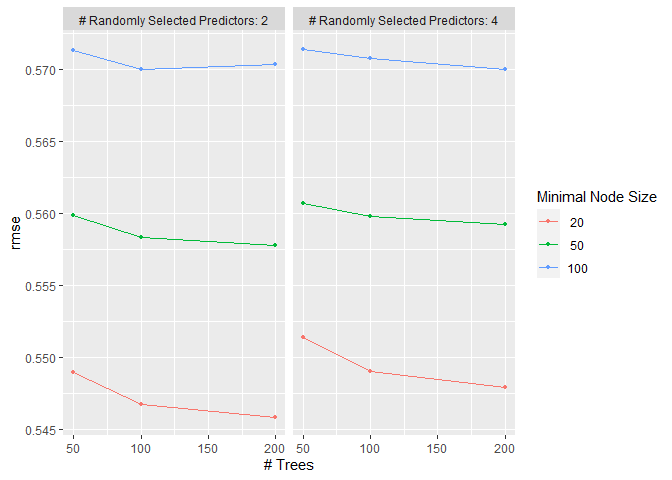
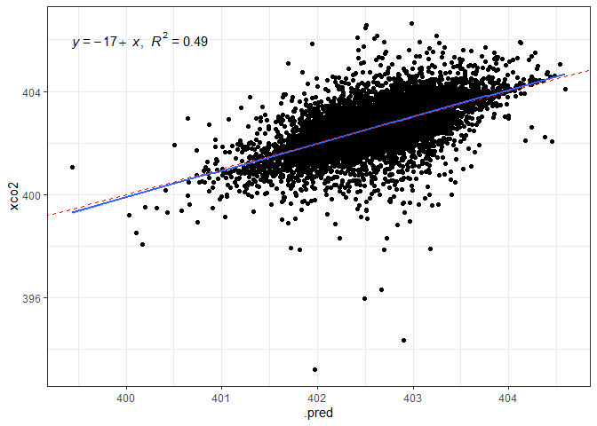
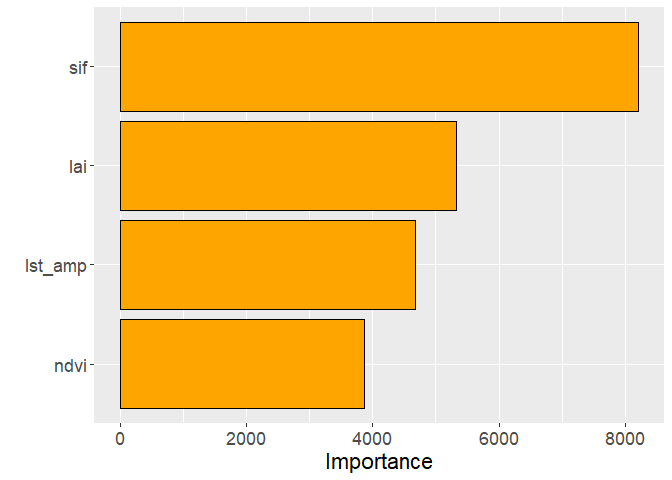

<!-- README.md is generated from README.Rmd. Please edit that file -->

# canteral-cap-3

## Carregando o pacote

``` r
library(tidyverse)
library(tidymodels)
library(gstat)
library(sp)
library(openxlsx)
library(readxl)
library(raster)
library(rstudioapi)
library(sp)
source("R/my-functions.R")
```

## Lendo a base de dados

``` r
arco_desmatamento <- readr::read_rds("data/arco_desmatamento.rds")
```

## Conhecendo a base

``` r
head(arco_desmatamento)
#> # A tibble: 6 × 16
#>   latitude longitude      x      y data                  mes   ano estacao  xco2
#>      <dbl>     <dbl>  <dbl>  <dbl> <dttm>              <dbl> <dbl> <chr>   <dbl>
#> 1   -0.903     -47.1 5.77e6 9.90e6 2015-01-01 00:00:00     1  2015 Chuvosa    NA
#> 2   -0.903     -47.4 5.74e6 9.90e6 2015-01-01 00:00:00     1  2015 Chuvosa    NA
#> 3   -0.903     -47.6 5.71e6 9.90e6 2015-01-01 00:00:00     1  2015 Chuvosa    NA
#> 4   -1.15      -46.9 5.80e6 9.87e6 2015-01-01 00:00:00     1  2015 Chuvosa    NA
#> 5   -1.15      -47.1 5.77e6 9.87e6 2015-01-01 00:00:00     1  2015 Chuvosa    NA
#> 6   -1.15      -47.4 5.74e6 9.87e6 2015-01-01 00:00:00     1  2015 Chuvosa    NA
#> # ℹ 7 more variables: sif <dbl>, ndvi <dbl>, lai <dbl>, lst_dia <dbl>,
#> #   lst_noite <dbl>, lst_amp <dbl>, ec <dbl>
```

# Análise geoestatística

## grid refinado para a interpolação

``` r
df_grid <- arco_desmatamento %>% 
  group_by(x,y) %>% 
  summarise(z = mean(xco2,na.rm = TRUE))

x<-df_grid$x
y<-df_grid$y
dis <- 20000 #Distância entre pontos
grid <- expand.grid(x=seq(min(x),max(x),dis), y=seq(min(y),max(y),dis))
sp::gridded(grid) = ~ x + y
```

## filtrar o banco de dados

``` r
my_string <- "xco2"
my_year <- 2020
df <- my_df_generator(arco_desmatamento, my_year, my_string)
head(df)
#> # A tibble: 6 × 3
#> # Groups:   x [6]
#>         x       y     z
#>     <dbl>   <dbl> <dbl>
#> 1 2922219 9140533  403.
#> 2 2923441 9111555  403.
#> 3 2931621 8937758  403.
#> 4 2949768 9141688  406.
#> 5 2950973 9112748  404.
#> 6 2952218 9083811  403.
```

## passando para o objeto

``` r
sp::coordinates(df)=~ x+y  
form <- z ~ 1 
```

## Verificando o Variograma experimental

``` r
cutoff_p <- 6e6
width_p <- 15
vari <- variogram(form, 
                  width = cutoff_p/width_p,
                  cutoff = cutoff_p ,
                  data=df)
vari %>%  
  ggplot(aes(x=dist, y=gamma)) +
  geom_point()
```

<!-- -->

``` r
m_vari <- fit.variogram(vari,
                        vgm(3.5,"Sph",30e5,3))
plot(vari,model=m_vari, col=1,pl=F,pch=16)
```

<!-- -->

``` r


# jpeg(paste0("semivariogramas/",my_string,"-",my_year,".jpeg"),         # File name
#        width=8, height = 8, units=c("cm"), res = 300)
#     plot(vari, model=m_vari, col=1,pl=F,pch=16,
#          cex.axis=0.5,cex.lab = 0.5, cex=0.75,
#          main = "f) 2020 -"~Xco[2]~(ppm),
#          xlab="Distância de separação (m)", ylab="Semivariância")
#     
# 
# dev.off() 
```

## Krigagem

``` r
ko_var <- krige(formula=form, df, grid, model=m_vari, 
    block=c(0,0),
    nsim=0,
    na.action=na.pass,
    debug.level=-1,  
    )
#> [using ordinary kriging]
#>  12% done 39% done 65% done 91% done100% done
```

``` r
as.tibble(ko_var)  %>%  
  ggplot(aes(x=x, y=y)) + 
  geom_tile(aes(fill = var1.pred)) +
  scale_fill_gradient(low = "yellow", high = "blue") + 
  coord_equal()
```

<!-- -->

``` r
contorno_arco <- read_rds("data/contorno_arco.rds")
pol_arco <- contorno_arco %>% as.matrix()
plot(as.tibble(grid) )
points(pol_arco[,1],pol_arco[,2],col="red")
```

<!-- -->

``` r
ko_var_df <- as.tibble(ko_var) %>% 
  mutate(flag = def_pol(x,y,pol_arco))
# como gravar ko_var_df de forma que tenhamos x, y e o nome da variável que está em "my_string)

obj_exp <- ko_var_df[1:3]
names(obj_exp) <- c("x","y",my_string)

# writexl::write_xlsx(obj_exp, paste0("mapas/",my_string,
#                                "-",my_year,".xlsx"))
```

``` r
# jpeg(paste0("mapas/",my_string,"-",my_year,".jpeg"),         # File name
#        width=25, height = 15, units=c("cm"), res = 300)
# 
# ko_var_df %>%
#   filter(flag) %>%
#     ggplot(aes(x=x,y=y)) +
#     geom_tile(aes(fill = var1.pred)) +
#     scale_fill_viridis_c() +
#     coord_equal() +labs(x="",y="") +
#   theme(
#     plot.title = element_text(size = 20),
#     axis.text.x = element_text(size = 15),
#     axis.text.y = element_text(size = 15),
#     legend.text = element_text(size = 12),
#     legend.title = element_text(size = 15)) +
#   labs(fill=expression(Xco[2]), title = paste0("f) ", my_year)) +
#   map_theme()
# 
# #scale_fill_gradient(low = "#984EA3", high = "#FFD92F") - SIF
# #scale_fill_gradient(low = "yellow", high = "#543005")  - LST_Amp
# #scale_fill_gradient(low = "#FFD92F", high = "#238B45") - LAI
# dev.off()
```

## Manipulação do banco de dados

### Listando aquivos xlsx

``` r
files <- list.files("mapas/", 
                    pattern = "xlsx",
                    full.names = TRUE)
```

``` r
df_final <- purrr::map_df(files,my_xlsx_reader)
df_final$variable %>% unique()
#> [1] "lai"     "lst_amp" "ndvi"    "sif"     "xco2"
df_final$year %>% unique()
#> [1] "2015" "2016" "2017" "2018" "2019" "2020"
```

## Calculando a Anomalia

``` r
df_final <- df_final %>% 
  pivot_wider(names_from = variable, values_from = z) %>% 
  group_by(year) %>% 
  mutate(
    anomaly_xco2 = xco2 - median(xco2,na.rm = TRUE)
  ) %>% 
  mutate(flag = def_pol(x,y,pol_arco))
```

## Exportando a base de dados após krigagem e anomalia

``` r
# write_rds(df_final, file = "data/base_krigagem.rds")
```

# Mapas de anomalia para xco2

``` r
# Criar uma função para a paleta de cores invertida
paleta_invertida <- function(n) {
  cores <- rainbow(n = n)
  cores_invertidas <- rev(cores)  # Inverte a ordem das cores
  return(cores_invertidas)
}

# Usar a função para obter a paleta de cores invertida
cores_invertidas <- paleta_invertida(5)  # Substitua 10 pelo número desejado de cores

anos <- 2015:2020
letras <- letters[1:length(anos)]

for(i in 1:length(anos)){
  ano <- anos[i]
  letra <- letras[i]
  # jpeg(paste0("anomalias/xco2-",ano,".jpeg"),
  #      width=25, height = 12, units=c("cm"), res = 300)
  plot_anom <- df_final %>%
    filter(year == ano, flag) %>%
    ggplot(aes(x=x,y=y)) +
    geom_tile(aes(fill = anomaly_xco2)) +
    scale_fill_gradientn(colours = cores_invertidas) +
    coord_equal() +labs(x="",y="") +
    theme(
      plot.title = element_text(size = 20),
      axis.text.x = element_text(size = 15),
      axis.text.y = element_text(size = 15),
      legend.text = element_text(size = 12),
      legend.title = element_text(size = 15)) +
    labs(fill=expression(Anomalia~Xco[2]), title = paste0(letra,") ", ano)) +
    map_theme()
  print(plot_anom)
  dev.off()
}
```

## Aprendizado de Máquina

### Definindo o plano de multisession

``` r
future::plan("multisession")
```

### Lendo a base

``` r
data_set <- read_rds("data/base_krigagem.rds") %>% 
  mutate(year = as.numeric(year))
```

### Inspesionar a base quanto a valores faltantes

``` r
visdat::vis_miss(data_set)
```

<!-- -->

``` r
glimpse(data_set)
#> Rows: 62,514
#> Columns: 10
#> Groups: year [6]
#> $ x            <dbl> 2895911, 2915911, 2935911, 2955911, 2975911, 2995911, 301…
#> $ y            <dbl> 8521695, 8521695, 8521695, 8521695, 8521695, 8521695, 852…
#> $ year         <dbl> 2015, 2015, 2015, 2015, 2015, 2015, 2015, 2015, 2015, 201…
#> $ lai          <dbl> 3.516391, 3.516391, 3.516391, 3.516391, 3.516391, 3.51639…
#> $ lst_amp      <dbl> 7.429373, 7.474454, 7.524238, 7.574065, 7.618265, 7.66285…
#> $ ndvi         <dbl> 0.6261607, 0.6276403, 0.6292759, 0.6312127, 0.6334661, 0.…
#> $ sif          <dbl> 0.7847935, 0.7847935, 0.7847935, 0.7847935, 0.7847935, 0.…
#> $ xco2         <dbl> 401.8826, 401.8826, 401.8826, 401.8826, 401.8826, 401.882…
#> $ anomaly_xco2 <dbl> 0, 0, 0, 0, 0, 0, 0, 0, 0, 0, 0, 0, 0, 0, 0, 0, 0, 0, 0, …
#> $ flag         <lgl> FALSE, FALSE, FALSE, FALSE, FALSE, FALSE, FALSE, FALSE, F…
```

### Definindo a Base de treino e teste

``` r
data_set_ml <- data_set
xco2_initial_split <- initial_split(data_set_ml, prop = 0.75)
xco2_train <- training(xco2_initial_split)
```

### Data prep

``` r
xco2_recipe <- recipe(xco2 ~ ., 
                      data = xco2_train %>% 
                        ungroup() %>% 
                        filter(year == 2015) %>% 
                        dplyr::select(lai:xco2) %>% 
                        sample_n(7795*0.01)
                        
) %>%  
  step_normalize(all_numeric_predictors())  %>% 
  step_novel(all_nominal_predictors()) %>% 
  step_zv(all_predictors()) #%>%
  #step_naomit(c(Ts, Us)) %>% 
  # step_impute_median(where(is.numeric)) %>% # inputação da mediana nos numéricos
  # step_poly(c(Us,Ts), degree = 2)  %>%  
  #step_dummy(all_nominal_predictors())
bake(prep(xco2_recipe), new_data = NULL)
#> # A tibble: 77 × 5
#>        lai lst_amp    ndvi     sif  xco2
#>      <dbl>   <dbl>   <dbl>   <dbl> <dbl>
#>  1  1.51   -0.807   0.912   0.132   402.
#>  2  2.68   -0.794   2.45    1.42    402.
#>  3  0.473  -0.459  -0.104  -0.0142  402.
#>  4 -0.538  -0.0869 -0.645  -2.94    401.
#>  5  0.0110  1.18   -0.485  -0.0142  402.
#>  6 -0.371  -0.652  -1.84    0.704   402.
#>  7 -3.31    1.24   -1.48   -0.434   401.
#>  8 -0.936   1.71    0.146  -0.991   401.
#>  9  0.526   0.821   0.820  -1.50    402.
#> 10  0.0110  0.187  -0.0320 -0.0142  402.
#> # ℹ 67 more rows
```

``` r
visdat::vis_miss(bake(prep(xco2_recipe), new_data = NULL))
```

<!-- -->

### Definição da reamostragem

``` r
xco2_resamples <- vfold_cv(xco2_train, v = 5)
```

### Definição do modelo

``` r
xco2_rf_model <- rand_forest(
  min_n = tune(),
  mtry = tune(),
  trees = tune()
)   %>%  
  set_mode("regression")  %>% 
  set_engine("randomForest")
```

### Workflow

``` r
xco2_rf_wf <- workflow()   %>%  
  add_model(xco2_rf_model) %>%  
  add_recipe(xco2_recipe)
```

### Tune

``` r
grid_rf <- expand.grid(
  min_n = c(20,21),
  mtry = c(2,4),
  trees = c(10) #<-----------------------
)
```

``` r
xco2_rf_tune_grid <- tune_grid(
 xco2_rf_wf,
  resamples = xco2_resamples,
  grid = grid_rf,
  metrics = metric_set(rmse)
)
autoplot(xco2_rf_tune_grid)
```

<!-- -->

``` r
collect_metrics(xco2_rf_tune_grid)
#> # A tibble: 4 × 9
#>    mtry trees min_n .metric .estimator  mean     n std_err .config             
#>   <dbl> <dbl> <dbl> <chr>   <chr>      <dbl> <int>   <dbl> <chr>               
#> 1     2    10    20 rmse    standard   0.567     5 0.00346 Preprocessor1_Model1
#> 2     2    10    21 rmse    standard   0.572     5 0.00352 Preprocessor1_Model2
#> 3     4    10    20 rmse    standard   0.571     5 0.00342 Preprocessor1_Model3
#> 4     4    10    21 rmse    standard   0.571     5 0.00277 Preprocessor1_Model4
```

``` r
xco2_rf_tune_grid %>%   show_best(metric = "rmse", n = 6)
#> # A tibble: 4 × 9
#>    mtry trees min_n .metric .estimator  mean     n std_err .config             
#>   <dbl> <dbl> <dbl> <chr>   <chr>      <dbl> <int>   <dbl> <chr>               
#> 1     2    10    20 rmse    standard   0.567     5 0.00346 Preprocessor1_Model1
#> 2     4    10    20 rmse    standard   0.571     5 0.00342 Preprocessor1_Model3
#> 3     4    10    21 rmse    standard   0.571     5 0.00277 Preprocessor1_Model4
#> 4     2    10    21 rmse    standard   0.572     5 0.00352 Preprocessor1_Model2
```

``` r
xco2_rf_best_params <- select_best(xco2_rf_tune_grid, "rmse")
xco2_rf_wf <- xco2_rf_wf %>% finalize_workflow(xco2_rf_best_params)
xco2_rf_last_fit <- last_fit(xco2_rf_wf, xco2_initial_split)
```

``` r
xco2_test_preds <- bind_rows(
  collect_predictions(xco2_rf_last_fit)  %>%   mutate(modelo = "rf")
)

xco2_test <- testing(xco2_initial_split)
visdat::vis_miss(xco2_test)
```

<!-- -->

``` r
xco2_test_preds %>% 
  ggplot(aes(x=.pred, y=xco2)) +
  geom_point()+
  theme_bw() +
  geom_smooth(method = "lm") +
  ggpubr::stat_regline_equation(ggplot2::aes(
  label =  paste(..eq.label.., ..rr.label.., sep = "*plain(\",\")~~"))) +
  geom_abline (slope=1, linetype = "dashed", color="Red")
```

<!-- -->

``` r
xco2_rf_last_fit_model <-xco2_rf_last_fit$.workflow[[1]]$fit$fit
vip::vip(xco2_rf_last_fit_model,
    aesthetics = list(color = "black", fill = "orange")) +
    theme(axis.text.y=element_text(size=rel(1.5)),
          axis.text.x=element_text(size=rel(1.5)),
          axis.title.x=element_text(size=rel(1.5))
          )
```

<!-- -->

``` r
da <- xco2_test_preds %>% 
  filter(xco2 > 0, .pred>0 )

my_r <- cor(da$xco2,da$.pred)
my_r2 <- my_r*my_r
my_mse <- Metrics::mse(da$xco2,da$.pred)
my_rmse <- Metrics::rmse(da$xco2,
                         da$.pred)
my_mae <- Metrics::mae(da$xco2,da$.pred)
my_mape <- Metrics::mape(da$xco2,da$.pred)*100


vector_of_metrics <- c(r=my_r, R2=my_r2, MSE=my_mse, RMSE=my_rmse, MAE=my_mae, MAPE=my_mape)
print(data.frame(vector_of_metrics))
#>      vector_of_metrics
#> r            0.6912584
#> R2           0.4778382
#> MSE          0.3061251
#> RMSE         0.5532857
#> MAE          0.2903066
#> MAPE         0.0721221
```
