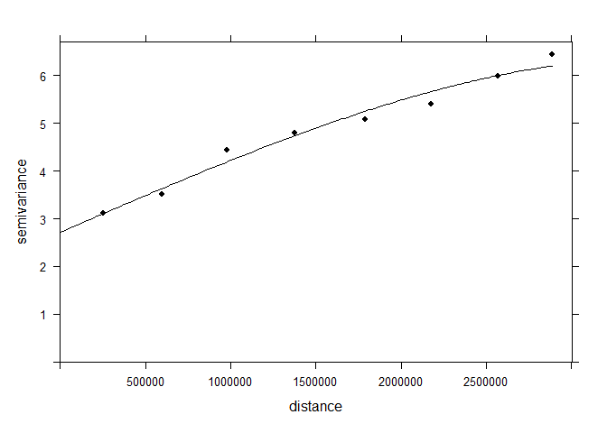

<!-- README.md is generated from README.Rmd. Please edit that file -->

# canteral-cap-3

## Carregando o pacote

``` r
library(tidyverse)
library(gstat)
library(sp)
source("R/my-functions.R")
```

## Lendo a base de dados

``` r
arco_desmatamento <- readr::read_rds("data/arco_desmatamento.rds")
```

## Conhecendo a base

``` r
head(arco_desmatamento)
#> # A tibble: 6 × 16
#>   latitude longitude      x      y data                  mes   ano estacao  xco2
#>      <dbl>     <dbl>  <dbl>  <dbl> <dttm>              <dbl> <dbl> <chr>   <dbl>
#> 1   -0.903     -47.1 5.77e6 9.90e6 2015-01-01 00:00:00     1  2015 Chuvosa    NA
#> 2   -0.903     -47.4 5.74e6 9.90e6 2015-01-01 00:00:00     1  2015 Chuvosa    NA
#> 3   -0.903     -47.6 5.71e6 9.90e6 2015-01-01 00:00:00     1  2015 Chuvosa    NA
#> 4   -1.15      -46.9 5.80e6 9.87e6 2015-01-01 00:00:00     1  2015 Chuvosa    NA
#> 5   -1.15      -47.1 5.77e6 9.87e6 2015-01-01 00:00:00     1  2015 Chuvosa    NA
#> 6   -1.15      -47.4 5.74e6 9.87e6 2015-01-01 00:00:00     1  2015 Chuvosa    NA
#> # ℹ 7 more variables: sif <dbl>, ndvi <dbl>, lai <dbl>, lst_dia <dbl>,
#> #   lst_noite <dbl>, lst_amp <dbl>, ec <dbl>
```

# Análise geoestatística

## grid refinado para a interpolação

``` r
df_grid <- arco_desmatamento %>% 
  group_by(x,y) %>% 
  summarise(z = mean(xco2,na.rm = TRUE))

x<-df_grid$x
y<-df_grid$y
dis <- 20000 #Distância entre pontos
grid <- expand.grid(x=seq(min(x),max(x),dis), y=seq(min(y),max(y),dis))
sp::gridded(grid) = ~ x + y
```

## filtrar o banco de dados

``` r
my_string <- "xco2"
my_year <- 2016
df <- my_df_generator(arco_desmatamento, my_year, my_string)
head(df)
#> # A tibble: 6 × 3
#> # Groups:   x [6]
#>         x       y     z
#>     <dbl>   <dbl> <dbl>
#> 1 2895911 9110346  405.
#> 2 2922219 9140533  404.
#> 3 2923441 9111555  403.
#> 4 2924704 9082580  403.
#> 5 2926007 9053609  402.
#> 6 2927351 9024641  401.
```

## passando para o objeto

``` r
sp::coordinates(df)=~ x+y  
form <- z ~ 1 
```

## Verificando o Variograma experimental

``` r
cutoff_p <- 19e5
width_p <- 7
vari <- variogram(form, 
                  width = cutoff_p/width_p,
                  cutoff = cutoff_p ,
                  data=df)
vari %>%  
  ggplot(aes(x=dist, y=gamma)) +
  geom_point()
```

<!-- -->

``` r
m_vari <- fit.variogram(vari,
                        vgm(7,"Sph",5e5,0))
plot(vari,model=m_vari, col=1,pl=F,pch=16)
```

<!-- -->

``` r

# implmentar: como guardar o gráfico na pasta semivariogramas
```

## Krigagem

``` r
ko_var <- krige(formula=form, df, grid, model=m_vari, 
    block=c(0,0),
    nsim=0,
    na.action=na.pass,
    debug.level=-1,  
    )
#> [using ordinary kriging]
#>   2% done  8% done 13% done 20% done 26% done 32% done 38% done 45% done 51% done 58% done 64% done 70% done 77% done 83% done 89% done 94% done100% done
```

``` r
as.tibble(ko_var)  %>%  
  ggplot(aes(x=x, y=y)) + 
  geom_tile(aes(fill = var1.pred)) +
  scale_fill_gradient(low = "yellow", high = "blue") + 
  coord_equal()
```

<!-- -->

``` r
contorno_arco <- read_rds("data/contorno_arco.rds")
pol_arco <- contorno_arco %>% as.matrix()
plot(as.tibble(grid) )
points(pol_arco[,1],pol_arco[,2],col="red")
```

<!-- -->

``` r
ko_var_df <- as.tibble(ko_var) %>% 
  mutate(flag = def_pol(x,y,pol_arco))
# como gravar ko_var_df de forma que tenhamos x, y e o nome da variável que está em "my_string)

obj_exp <- ko_var_df[1:3]
names(obj_exp) <- c("x","y",my_string)

writexl::write_xlsx(obj_exp, paste0("mapas/",my_string,
                               "-",my_year,".xlsx"))
```

``` r
ko_var_df %>% 
  filter(flag) %>% 
    ggplot(aes(x=x,y=y)) +
    geom_tile(aes(fill = var1.pred)) +
    scale_fill_viridis_c() +
    coord_equal() +labs(x="",y="") +
  theme_bw() +
  labs(fill=my_string,title = my_year) + 
  map_theme()
```

<!-- -->
